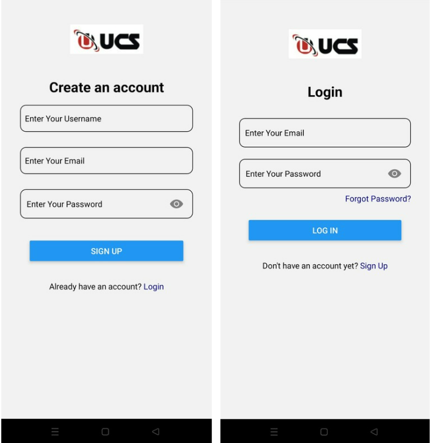

# TimeSheet-UCS

**TimeSheet-UCS is a comprehensive timesheet management application designed to help employees and administrators efficiently manage work-related activities.** 

### Features:
#### Employee Check-In and Check-Out Tracking
- Log daily work timings with ease for accurate time tracking.

#### Task Management
- Add, update, and review daily tasks and assignments.

#### Leave Application System
- Seamlessly apply for and monitor leave requests.

#### Attendance Management
- Admin functionality for overseeing and maintaining employee attendance records.

#### Compensatory Off Tracking
- Monitor weekend work, public holiday shifts, and overtime, allowing employees to earn and redeem compensatory offs.

### App Interface

#### Sign-up and Login Screens

#### Employee-Interface

#### Dashboard

#### Tasks

#### Apply for Leave

#### Attendance

#### Compensatory Off 

#### Admin-Interface

#### Employee Management Dashboard

#### Admin Dashboard

#### Leave Application Management 

 
#### Attendance Management 

#### Compensatory Off Application Management 